<<<<<<< HEAD
# multi-tier-vpc-architecture
A 3-tier network architecture built from scratch on AWS
=======
# 🌐 Multi-Tier VPC Architecture — AWS SAA Portfolio Project


---

## 📌 Overview

A 3-tier network architecture built from scratch on AWS — the most commonly tested pattern in the AWS Solutions Architect Associate exam, and the foundation of virtually every production AWS deployment.

Almost nobody at entry level has this in their portfolio. It demonstrates genuine understanding of how networks are designed in AWS, not just how to launch individual services.

Built twice: first manually via the AWS Console to understand every component, then as a CloudFormation template so the entire environment can be destroyed and recreated in under 10 minutes from a single file.

---

## 🏗️ Architecture

```
  INTERNET
     │
     │ HTTP/HTTPS
     ▼
┌─────────────────────────────────────────────────────────────────┐
│                  AWS CLOUD — us-east-1                          │
│                                                                 │
│  ┌──────────────────────────────────────────────────────────┐   │
│  │          VPC: multi-tier-vpc  (10.0.0.0/16)             │   │
│  │                                                          │   │
│  │  ── TIER 1: PUBLIC (Web Layer) ────────────────────────  │   │
│  │                                                          │   │
│  │  public-subnet-1a         public-subnet-1b               │   │
│  │  10.0.1.0/24 (1a)         10.0.4.0/24 (1b)              │   │
│  │                                                          │   │
│  │  [Internet Gateway] ← only route to internet            │   │
│  │  [ALB] ← accepts HTTP/HTTPS from 0.0.0.0/0              │   │
│  │  [Bastion Host] ← SSH from My IP only                   │   │
│  │  [NAT Gateway] ← gives private subnets outbound         │   │
│  │                                                          │   │
│  │  ── TIER 2: PRIVATE (App Layer) ───────────────────────  │   │
│  │                                                          │   │
│  │  private-app-1a           private-app-1b                 │   │
│  │  10.0.2.0/24 (1a)         10.0.5.0/24 (1b)              │   │
│  │                                                          │   │
│  │  [EC2 app-server-1a]      [EC2 app-server-1b]           │   │
│  │   Nginx | no public IP     Nginx | no public IP          │   │
│  │   Outbound: NAT GW only    SSM Session Manager           │   │
│  │                                                          │   │
│  │  ── TIER 3: PRIVATE (Data Layer) ──────────────────────  │   │
│  │                                                          │   │
│  │  private-data-1a          private-data-1b                │   │
│  │  10.0.3.0/24 (1a)         10.0.6.0/24 (1b)              │   │
│  │                                                          │   │
│  │  [RDS MySQL 8.0]                                         │   │
│  │   Encrypted | No internet access                         │   │
│  │   Port 3306 from app tier ONLY                           │   │
│  │                                                          │   │
│  │  ── SECURITY LAYERS ────────────────────────────────────  │   │
│  │                                                          │   │
│  │  Security Groups: sg-alb → sg-app → sg-rds (chained)    │   │
│  │  NACLs: public-nacl / private-app-nacl / private-data    │   │
│  │  VPC Flow Logs: ALL traffic → S3 → queryable via Athena  │   │
│  └──────────────────────────────────────────────────────────┘   │
└─────────────────────────────────────────────────────────────────┘
```

> 📐 Full draw.io diagram: [`docs/Architecture-diagram.png`](docs/Architecture-diagram.png)

---

## ☁️ AWS Services Used

| Service | Purpose | SAA Domain |
|---------|---------|-----------|
| Amazon VPC (10.0.0.0/16) | Isolated private network | Secure |
| 6 Subnets across 2 AZs | Network segmentation + resilience | Resilient |
| Internet Gateway | VPC-to-internet connectivity | Networking |
| NAT Gateway + Elastic IP | Private subnet outbound access | Secure |
| Route Tables ×3 | Per-tier traffic routing rules | Networking |
| Security Groups ×4 | Stateful instance-level firewall | Secure |
| NACLs ×3 | Stateless subnet-level firewall | Secure |
| Application Load Balancer | HTTP traffic across both AZs | Resilient |
| EC2 ×2 (t2.micro) | Nginx app servers in private subnets | Compute |
| EC2 Bastion Host | Secure admin entry point | Secure |
| SSM Session Manager | SSH-free EC2 access | Secure |
| RDS MySQL 8.0 (db.t3.micro) | Managed database in data tier | Database |
| VPC Flow Logs | Full network traffic audit trail | Secure |
| Amazon S3 | Flow logs storage | Cost-Optimised |
| Amazon Athena | SQL queries on flow logs | Analytics |
| AWS CloudFormation | Entire stack as code | IaC |

---

## 🔒 Defence in Depth — 4 Security Layers

This is the most important concept in this project. An attacker trying to reach the database must breach four completely independent security layers.

### Layer 1 — Route Table Isolation
The data tier subnet has no route to the internet — not to the NAT Gateway, not to the Internet Gateway. This is structural isolation. No amount of misconfigured security groups can bypass a missing route.

### Layer 2 — NACLs (Network ACLs)
NACLs operate at the subnet boundary. The data tier NACL allows ONLY MySQL traffic (port 3306) from the app subnet range (10.0.2.0/23). Everything else — including traffic from the public tier — is denied by the NACL before it even reaches the EC2 or RDS instance.

### Layer 3 — Security Groups
Security Group chaining means the RDS security group only accepts connections from instances that have the app security group attached. Not from an IP address — from a security group. This is dynamic: even as EC2 instances are replaced by the ASG, the rule stays valid.

### Layer 4 — No Public IPs + SSM
App server EC2s have no public IP addresses. Even if all three layers above failed, there is no address for an attacker to connect to from the internet. Admin access uses SSM Session Manager with no open port 22.

---

## 📊 Security Groups vs NACLs — Comparison Table

This is one of the most tested topics in the SAA exam. Know this cold.

| Feature | Security Groups | NACLs |
|---------|----------------|-------|
| Operates at | Instance level | Subnet level |
| State | **Stateful** — return traffic allowed automatically | **Stateless** — must explicitly allow both directions |
| Rule types | Allow rules only | Both Allow and Deny rules |
| Rule evaluation | All rules evaluated, most permissive wins | Rules evaluated in number order — first match wins |
| Default behaviour | Deny all inbound, allow all outbound | Default NACL allows everything |
| Best for | Controlling what a specific instance can talk to | Broad subnet-level controls + explicit denies |
| When to use | Always — first line of defence | Additional layer, especially for explicit denies |

**The key exam scenario:** A user can connect to an EC2 inbound but cannot receive a response. This is almost always a NACL outbound rule issue — NACLs are stateless, so you must explicitly allow return traffic (ephemeral ports 1024-65535).

---

## 🗺️ Subnet Design Explained

```
VPC CIDR: 10.0.0.0/16  (65,536 addresses)

┌─────────────────────────────────────────────────────┐
│  us-east-1a                  us-east-1b             │
│                                                     │
│  public-subnet-1a            public-subnet-1b       │
│  10.0.1.0/24 (251 usable)    10.0.4.0/24            │
│  Route: 0.0.0.0/0 → IGW      Route: 0.0.0.0/0 → IGW│
│                                                     │
│  private-app-1a              private-app-1b         │
│  10.0.2.0/24                 10.0.5.0/24            │
│  Route: 0.0.0.0/0 → NAT GW  Route: 0.0.0.0/0 → NAT│
│                                                     │
│  private-data-1a             private-data-1b        │
│  10.0.3.0/24                 10.0.6.0/24            │
│  Route: local only           Route: local only      │
└─────────────────────────────────────────────────────┘
```

**Why /24 subnets?** Each /24 gives 256 addresses (251 usable — AWS reserves 5 per subnet). For a learning project this is more than enough. In production you'd plan based on expected EC2 count + room to grow.

**Why are subnets "public" or "private"?** This is NOT a property of the subnet itself. A subnet is public if — and only if — its route table has a route pointing to an Internet Gateway. That's the entire definition. Change the route table, change whether it's public or private.

---

## 📁 Repository Structure

```
aws-multi-tier-vpc/
├── cloudformation/
│   └── multi-tier-vpc.yaml       # Full IaC — entire stack as code
├── README.md
├── Architecture-diagram.png
└── docs/
    ├── ss01-vpc-created.png
    ├── ss02-all-6-subnets.png
    ├── ss03-route-tables.png
    ├── ss04-security-group-chaining.png
    ├── ss05-nacls.png
    ├── ss06-alb-healthy.png
    ├── ss07-nginx-in-browser.png
    ├── ss08-ssm-session.png
    ├── ss09-rds-connected.png
    ├── ss10-flow-logs-s3.png
    ├── ss11-athena-query.png
    └── ss12-cloudformation-stack.png
```

---

## 🚀 Deploy with CloudFormation

```bash
# One command deploys everything
aws cloudformation create-stack \
  --stack-name multi-tier-vpc \
  --template-body file://cloudformation/multi-tier-vpc.yaml \
  --parameters \
    ParameterKey=KeyPairName,ParameterValue=ec2-key \
    ParameterKey=MyIPAddress,ParameterValue=$(curl -s ifconfig.me)/32 \
    ParameterKey=DBPassword,ParameterValue=YourStrongPassword123 \
  --capabilities CAPABILITY_NAMED_IAM \
  --region us-east-1

# Watch it build (~10 minutes)
aws cloudformation describe-stacks \
  --stack-name multi-tier-vpc \
  --query 'Stacks[0].StackStatus'

# Get your ALB URL and RDS endpoint
aws cloudformation describe-stacks \
  --stack-name multi-tier-vpc \
  --query 'Stacks[0].Outputs'

# Delete everything when done
aws cloudformation delete-stack --stack-name multi-tier-vpc
```

---

## 📸 Screenshots

| Screenshot | Description |
|------------|-------------|
| 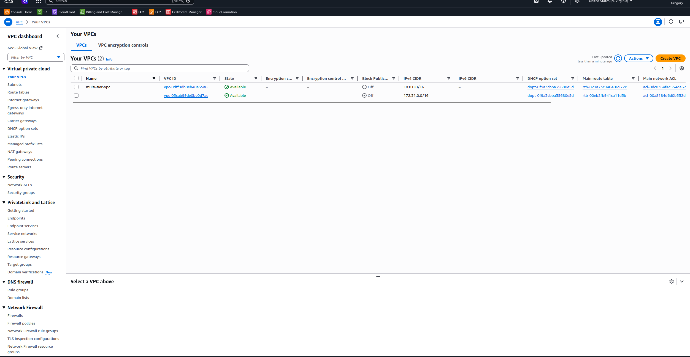 | **VPC** — multi-tier-vpc, CIDR 10.0.0.0/16, DNS hostnames enabled |
| 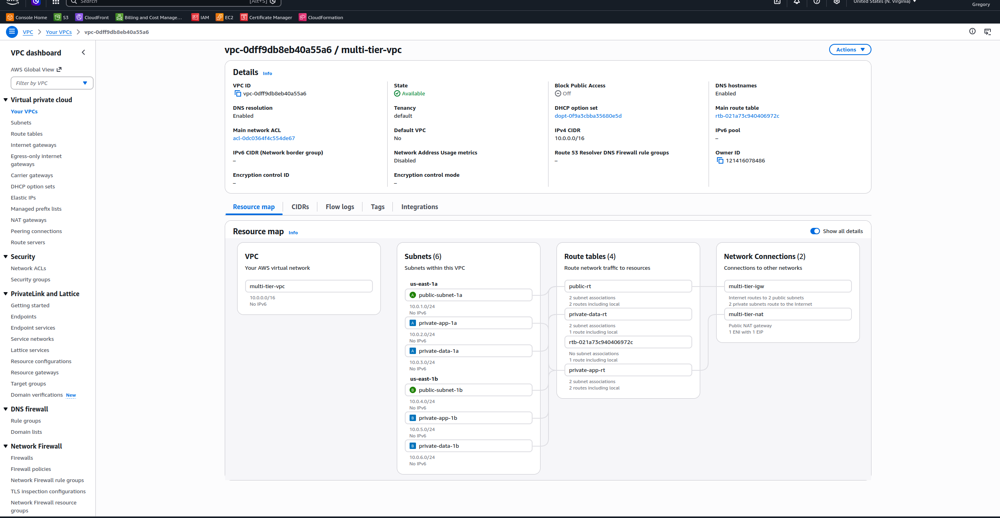 | **All 6 Subnets** — 3 tiers × 2 AZs, CIDRs and AZ assignments |
| 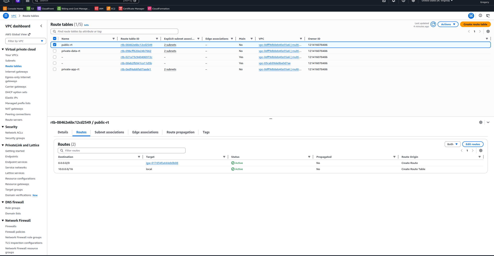 | **Route Tables** — public → IGW, private-app → NAT, data → no internet |
| 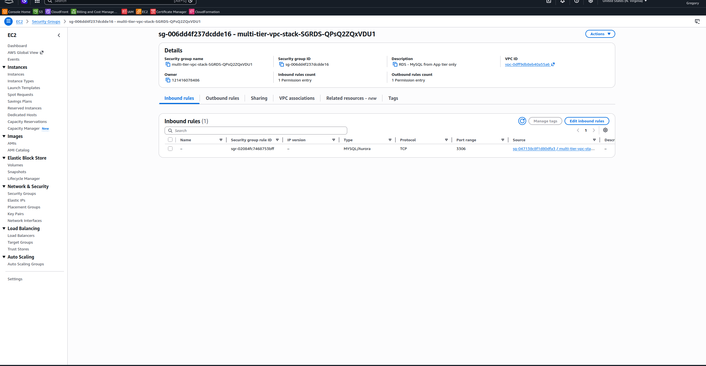 | **Security Group chaining** — sg-rds source is sg-app, not an IP address |
| 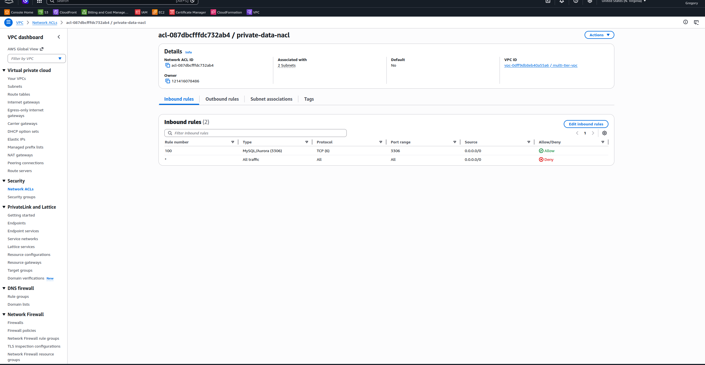 | **NACLs** — private-data-nacl allowing only port 3306 from app subnets |
|  | **ALB Target Group** — both app servers healthy across both AZs ✅ |
| 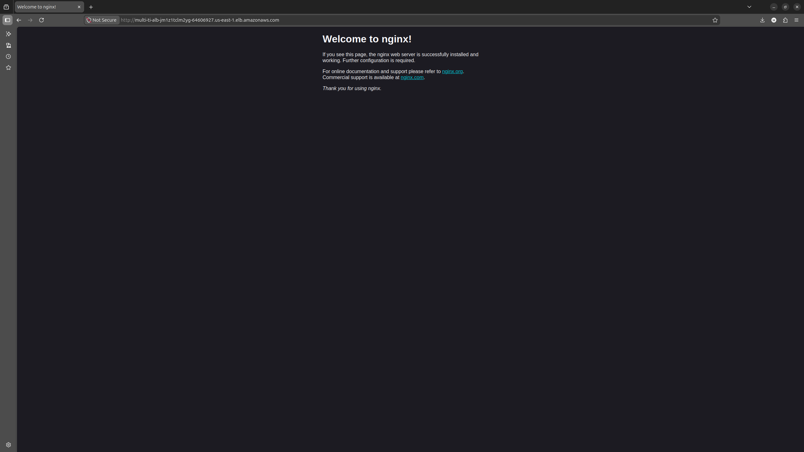 | **App page** — loading via ALB DNS from private subnet EC2 |
| 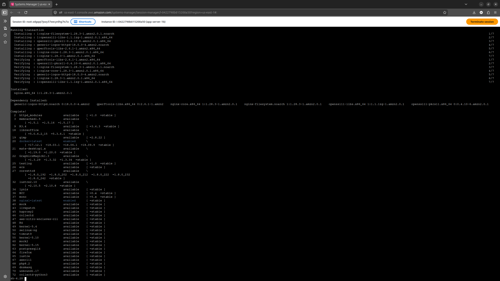 | **SSM Session Manager** — browser terminal connected, no SSH required |
| 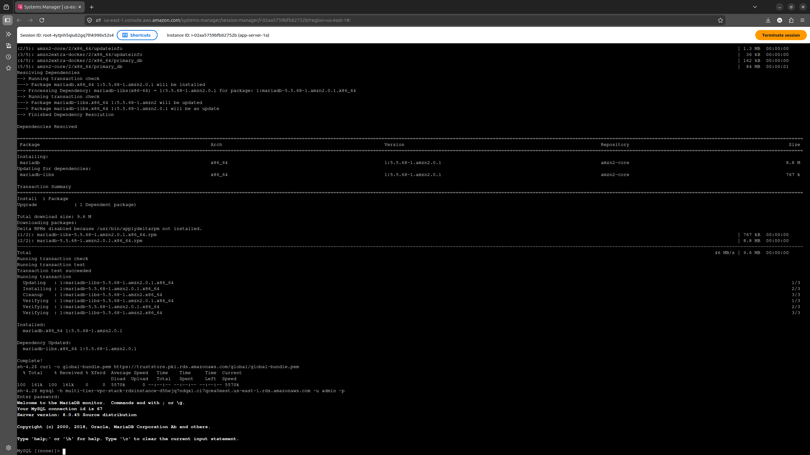 | **RDS MySQL** — connected from app server via SSM, SHOW DATABASES output |
| 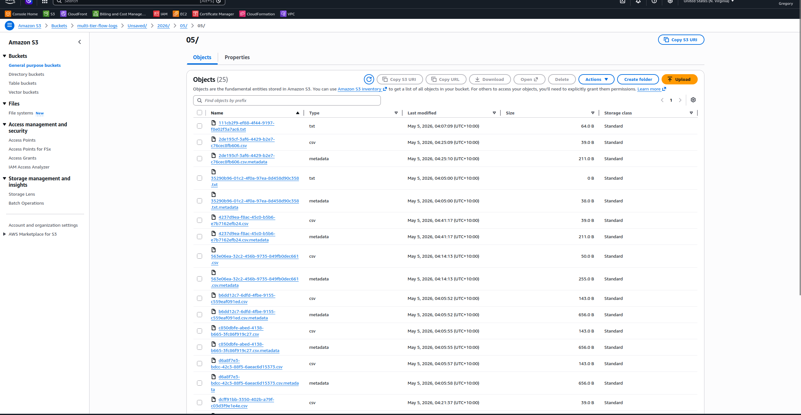 | **VPC Flow Logs** — log files being written to S3 bucket |
| 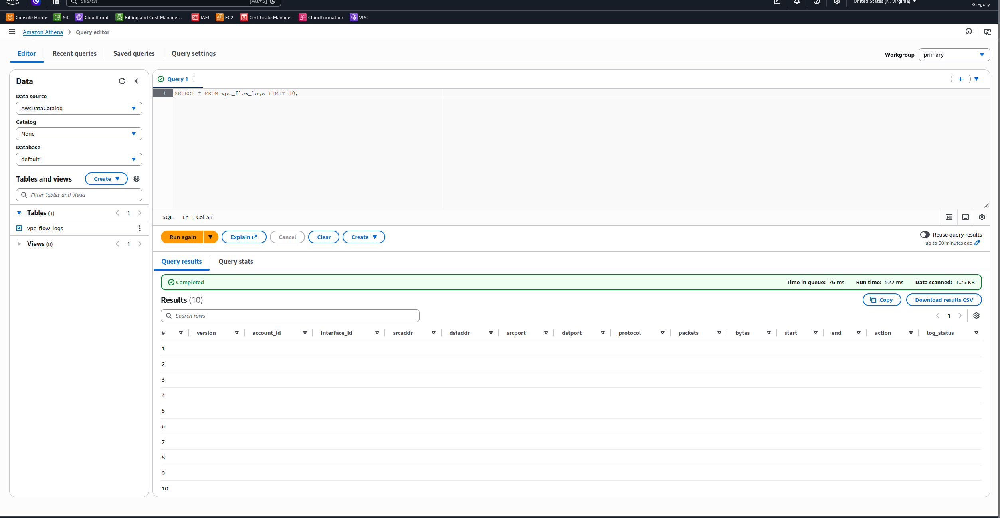 | **Athena Query** — REJECT traffic query results from flow logs |
| 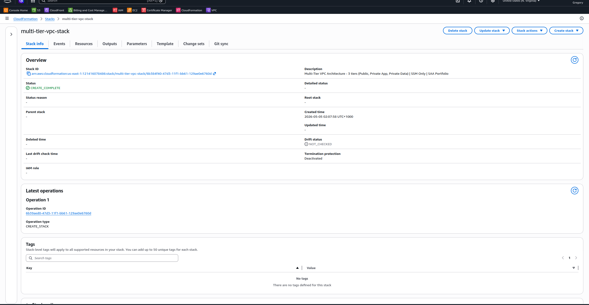 | **CloudFormation Stack** — CREATE_COMPLETE, all resources, Outputs tab |

---

## 💡 Key Decisions Explained

**Why 6 subnets across 2 AZs?**
A single AZ failure (which does happen — us-east-1 has had multiple) would take down a single-AZ architecture entirely. Spreading across two AZs means the ALB keeps routing to the surviving AZ while AWS restores the affected one. Two AZs is the minimum for High Availability. Three AZs is used for critical production systems.

**Why a separate data tier with no internet route at all?**
The database is the most valuable part of any application — it contains user data, business data, everything worth stealing. Putting it in a subnet with no internet route at all (not even outbound NAT) means it cannot initiate any outbound connection and cannot be reached from outside the VPC under any circumstances. This is maximum isolation.

**Why Bastion Host AND SSM Session Manager?**
The Bastion Host pattern is built first to show the classic approach — you will see this in existing AWS environments and SAA exam questions. SSM Session Manager is built next to show the modern replacement. Understanding both, and why SSM is better, is a more complete answer than only knowing one.

**Why VPC Flow Logs to S3 instead of CloudWatch?**
CloudWatch Logs charges per GB of ingestion and storage. For VPC Flow Logs which can generate significant volume, S3 is dramatically cheaper — roughly 10× less expensive for the same data. Athena queries the S3 data for ad-hoc analysis without needing to ingest into CloudWatch. For real-time alerting you'd send specific logs to CloudWatch; for forensics and analysis, S3 is the right choice.

**Why CloudFormation over console?**
Three reasons: reproducibility (the entire environment can be rebuilt in minutes), documentation (the template IS the documentation), and drift detection (CloudFormation can tell you if someone made a manual change that doesn't match the template). Console-built infrastructure is none of these things.

---

## 🧠 What I Learned — SAA Concepts

**VPC fundamentals**
- CIDR notation and subnet sizing (/16, /24 — what they mean)
- Internet Gateway vs NAT Gateway — and why private subnets need both
- What actually makes a subnet public vs private (the route table)
- Route table priority — longest prefix match wins

**Security layers**
- Security Groups: stateful, instance-level, allow-only rules
- NACLs: stateless, subnet-level, allow + deny rules, numbered rule order
- Why you need both — defence in depth
- Ephemeral ports and why NACLs need explicit return traffic rules

**Database**
- RDS subnet groups and why they require 2 AZs
- Multi-AZ vs Read Replicas — HA vs performance (different things!)
- Why RDS should never be publicly accessible

**Flow Logs**
- What VPC Flow Logs capture (and what they don't)
- S3 vs CloudWatch as destinations — cost vs real-time tradeoff
- Using Athena to query logs with SQL at minimal cost

**Infrastructure as Code**
- CloudFormation template structure: Parameters → Resources → Outputs
- !Ref vs !GetAtt — when to use each
- DependsOn — controlling resource creation order
- How to destroy an entire environment cleanly with one command

---

## ⚠️ Cost Management

| Resource | Free Tier | Note |
|----------|-----------|------|
| EC2 t2.micro ×3 | 750hrs/month | Stop when not using |
| RDS db.t3.micro | 750hrs/month | Stop when not using |
| ALB | 750hrs/month | Delete after project |
| NAT Gateway | NOT free (~$1/day) | Delete after screenshots |
| Elastic IP (idle) | $0.005/hr | Release after deleting NAT GW |
| VPC, Subnets, IGW, RT | Always free | Leave as-is |
| S3 Flow Logs | Minimal | 30-day lifecycle auto-deletes |

**One command cleanup:**
```bash
aws cloudformation delete-stack --stack-name multi-tier-vpc --region us-east-1
```
Deletes all resources in the correct order automatically. Takes ~10 minutes.

---

## 🔗 Related Projects

| Project | Relationship |
|---------|-------------|
| [aws-ec2-secure-webserver](https://github.com/GregorySuzan/aws-ec2-secure-webserver) | Uses similar VPC pattern — compare the two approaches |
| [aws-serverless-api-lambda](https://github.com/GregorySuzan/aws-serverless-api-lambda) | Serverless alternative to the EC2 compute tier |

---

## 👤 Author

**Gregory Suzan** — Cloud Engineer | AWS SAA Candidate | Ex-Graphic Designer
📍 Brisbane, Australia | [GitHub](https://github.com/GregorySuzan)
>>>>>>> b039809 (Complete 3-Tier Architecture with Flow Logs and Athena)
